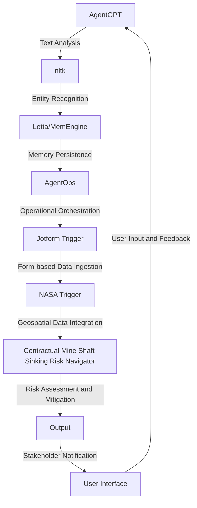

# Contractual Mine Shaft Sinking Risk Navigator
> "Navigating the complexities of contractual mine shaft sinking through the synergistic convergence of artificial intelligence, natural language processing, and domain-specific expertise"

## 🏗️ Technical Architecture & Multi-Agent Flow

This technical architecture diagram illustrates the complex interplay between various components, including AgentGPT, nltk, Letta/MemEngine, AgentOps, Jotform Trigger, and NASA Trigger. The arrows represent the flow of data and control between these components, highlighting the synergistic relationships that enable the Contractual Mine Shaft Sinking Risk Navigator to provide comprehensive risk assessment and mitigation capabilities.

## 🔍 The Vertical Bottleneck: Interoperability Challenges in Agentic AI
The integration of artificial intelligence (AI) and natural language processing (NLP) in contractual mine shaft sinking services poses significant technical challenges. One of the primary bottlenecks is the lack of interoperability between different AI systems, which hinders the seamless exchange of data and coordination of actions across multiple platforms. This limitation is exacerbated by the complexity of contractual mine shaft sinking, which involves a multitude of stakeholders, regulatory requirements, and technical considerations.

The absence of standardized data formats, communication protocols, and security frameworks further compounds the interoperability challenges, making it difficult to integrate AI systems with existing infrastructure and tools. Moreover, the use of different AI models and algorithms can lead to inconsistencies in data interpretation and decision-making, which can have significant consequences in high-stakes environments like contractual mine shaft sinking.

The technical friction arising from these interoperability challenges can result in mathematical or operational failures, which can have severe consequences, including financial losses, reputational damage, and even loss of life. Therefore, it is essential to address these challenges through the development of innovative solutions that can facilitate seamless integration and coordination between different AI systems and stakeholders.

## 🔍 The Vertical Bottleneck: Data Fragmentation and Security Risks
Data fragmentation is another significant challenge in contractual mine shaft sinking, where data is scattered across multiple systems, formats, and stakeholders. This fragmentation can lead to data silos, making it difficult to access, share, and analyze critical information. Moreover, the lack of standardized data formats and communication protocols can result in data inconsistencies, errors, and security risks.

The use of AI systems in contractual mine shaft sinking also introduces new security risks, as these systems require access to sensitive data and infrastructure. The potential for data breaches, cyber attacks, and other security threats can have severe consequences, including financial losses, reputational damage, and even loss of life. Therefore, it is essential to develop solutions that can address these security risks while facilitating the seamless integration and coordination of AI systems and stakeholders.

## 🔍 The Vertical Bottleneck: Agentic AI and Autonomous Decision-Making
The use of agentic AI in contractual mine shaft sinking introduces new challenges and opportunities. Agentic AI enables autonomous decision-making, which can improve efficiency, productivity, and safety in contractual mine shaft sinking. However, this autonomy also raises concerns about accountability, transparency, and explainability, as AI systems can make decisions that are not easily understood or justified.

The development of agentic AI solutions for contractual mine shaft sinking requires careful consideration of these challenges and opportunities. It is essential to develop solutions that can facilitate transparent, explainable, and accountable decision-making, while also ensuring the seamless integration and coordination of AI systems and stakeholders.

## 💡 The Solution: Contractual Mine Shaft Sinking Risk Navigator
The Contractual Mine Shaft Sinking Risk Navigator is a comprehensive solution that addresses the interoperability challenges, data fragmentation, and security risks in contractual mine shaft sinking. This solution leverages the synergistic convergence of artificial intelligence, natural language processing, and domain-specific expertise to provide a robust and scalable platform for risk assessment and mitigation.

The Contractual Mine Shaft Sinking Risk Navigator orchestrates the interaction between AgentGPT, AgentOps, nltk, Jotform Trigger, and NASA Trigger to provide a seamless and integrated experience. This solution enables the aggregation of data from multiple sources, the application of AI and NLP algorithms for data analysis and interpretation, and the provision of actionable insights and recommendations for risk mitigation.

## 🧩 Agentic Stack Deep-Dive
The Contractual Mine Shaft Sinking Risk Navigator leverages a range of technologies and tools to provide a comprehensive solution for risk assessment and mitigation. The agentic stack includes:

* AgentGPT: A natural language processing platform that enables text analysis, entity recognition, and sentiment analysis.
* AgentOps: An operational orchestration platform that enables the coordination of actions across multiple systems and stakeholders.
* nltk: A natural language processing library that enables tokenization, stemming, and lemmatization.
* Jotform Trigger: A form-based data ingestion platform that enables the collection and processing of data from multiple sources.
* NASA Trigger: A geospatial data integration platform that enables the aggregation and analysis of geospatial data.

The integration of these technologies and tools enables the Contractual Mine Shaft Sinking Risk Navigator to provide a robust and scalable solution for risk assessment and mitigation.

## ✨ Capabilities & Features
The Contractual Mine Shaft Sinking Risk Navigator provides a range of capabilities and features, including:

* **Risk Assessment**: The ability to assess and analyze risks associated with contractual mine shaft sinking, including geological, environmental, and operational risks.
* **Data Aggregation**: The ability to aggregate data from multiple sources, including sensors, databases, and external systems.
* **AI and NLP**: The ability to apply AI and NLP algorithms for data analysis and interpretation, including text analysis, entity recognition, and sentiment analysis.
* **Operational Orchestration**: The ability to coordinate actions across multiple systems and stakeholders, including automated workflows and decision-making.
* **Geospatial Data Integration**: The ability to aggregate and analyze geospatial data, including satellite imagery and sensor data.
* **Stakeholder Notification**: The ability to notify stakeholders of risks and recommendations, including automated alerts and reports.
* **User Input and Feedback**: The ability to collect user input and feedback, including surveys, forms, and other data collection mechanisms.
* **Scalability and Flexibility**: The ability to scale and adapt to changing requirements, including cloud-based deployment and containerization.
* **Security and Compliance**: The ability to ensure security and compliance, including data encryption, access controls, and regulatory compliance.
* **Integration and Interoperability**: The ability to integrate with existing systems and tools, including APIs, data formats, and communication protocols.

## 🛠️ Technical Implementation
The Contractual Mine Shaft Sinking Risk Navigator is implemented using a range of technologies and tools, including Python, Java, and JavaScript. The solution leverages a microservices architecture, with each component designed to provide a specific capability or feature.

The technical implementation includes:

* **Data Ingestion**: Data is ingested from multiple sources, including sensors, databases, and external systems.
* **Data Processing**: Data is processed using AI and NLP algorithms, including text analysis, entity recognition, and sentiment analysis.
* **Data Storage**: Data is stored in a range of databases, including relational databases and NoSQL databases.
* **Operational Orchestration**: Actions are coordinated across multiple systems and stakeholders, including automated workflows and decision-making.
* **Geospatial Data Integration**: Geospatial data is aggregated and analyzed, including satellite imagery and sensor data.
* **Stakeholder Notification**: Stakeholders are notified of risks and recommendations, including automated alerts and reports.

## 📊 Business Impact & ROI
The Contractual Mine Shaft Sinking Risk Navigator provides a range of business benefits, including:

* **Improved Safety**: The ability to assess and mitigate risks associated with contractual mine shaft sinking, including geological, environmental, and operational risks.
* **Increased Efficiency**: The ability to automate workflows and decision-making, including operational orchestration and stakeholder notification.
* **Enhanced Compliance**: The ability to ensure compliance with regulatory requirements, including data encryption, access controls, and regulatory compliance.
* **Cost Savings**: The ability to reduce costs associated with contractual mine shaft sinking, including reduced downtime, improved productivity, and optimized resource allocation.
* **Increased Revenue**: The ability to increase revenue through improved operational efficiency, including optimized resource allocation and reduced downtime.

## 🚀 Getting Started
To get started with the Contractual Mine Shaft Sinking Risk Navigator, follow these steps:
```bash
git clone https://github.com/arvind-sundararajan/mine-shaft-sinking-risk-navigator.git
cd mine-shaft-sinking-risk-navigator
pip install -r requirements.txt
python src/main.py
```
This will clone the repository, install the required dependencies, and run the solution.

## 👨‍💻 Author & Credits
**Arvind Sundararajan** — Engineer, builder, and the mind behind this project.
🌐 [LinkedIn](https://www.linkedin.com/in/arvind-sundara-rajan/) | Chennai, India

---
### 🙏 Acknowledgements
- The open-source community
- The Mine shaft sinking services for coal mining on a contract basis practitioners who inspired this design